## select 
for searchin in database we use select

for select all item in the database we write:

select * from the tablename 

and if we want something specific we write it nested of * 

and we can display many colom by :

select colom1,colom2 ... from table name 

and we can specific row by put where +your condition 
## INNER JOIN 
TO DISPLAY data from two table in one row ue used inner join 

## Inserting rows

What is a Schema?
 describes the structure of each table, and the datatypes that each column of the table can contain.
 ## UPDATE 
 UPDATE TABLENAME SET (WHAT TO CHANGE ) WHERE (THE CONDITION)

 ## CREATE
 TO CREATE A TABLE WE WRITE 
 CREATE TABLE TABLENAME (THE CONTENT WITH DATA TAYPE END WITH ,)

## Altering tables
ALTER TABLE mytable
1. ADD column DataType OptionalTableConstraint 
    DEFAULT default_value;
    THIS TO ADD NEW COLUMN 
2. ALTER TABLE mytable
DROP column_to_be_deleted;
THIS TO DELETE THE COLOMS 
3. ALTER TABLE mytable
RENAME TO new_table_name;
THIS TO RENAME THE TABLE 
## Dropping tables
DROP TABLE IF EXISTS mytable;
THIS DELETE THE TABLE IF IT WAS EXIST

### this pictur for the exercis 

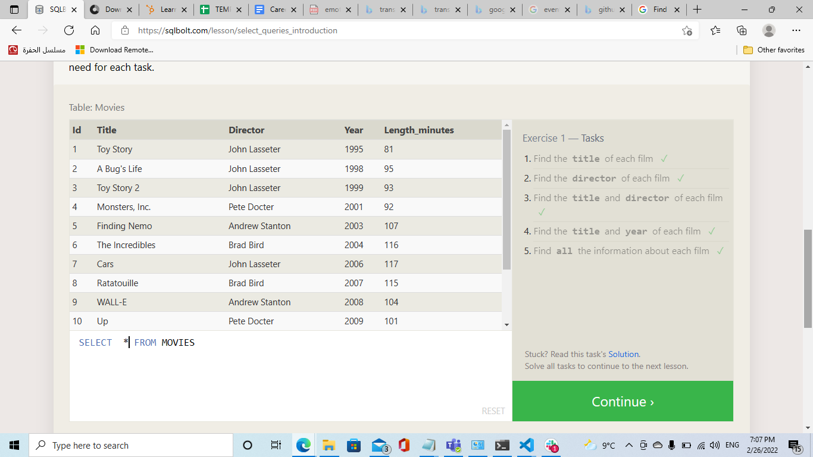
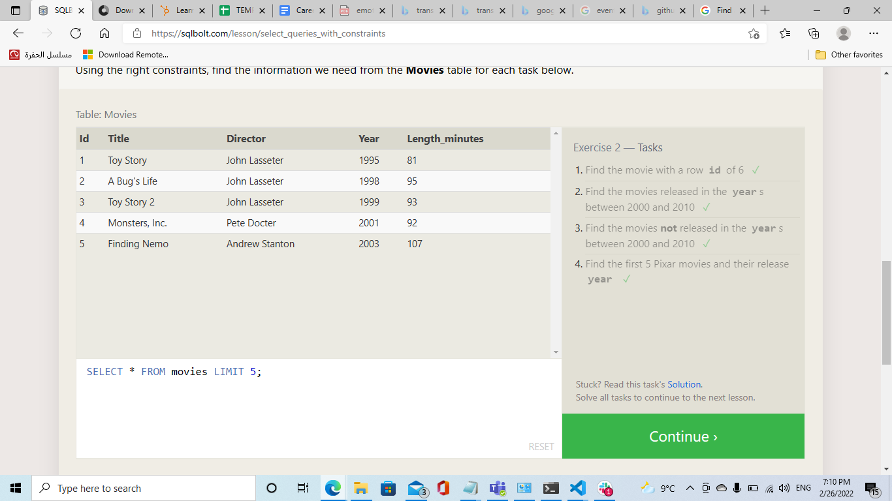
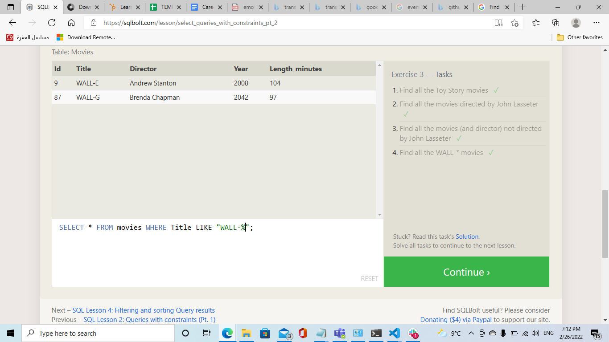
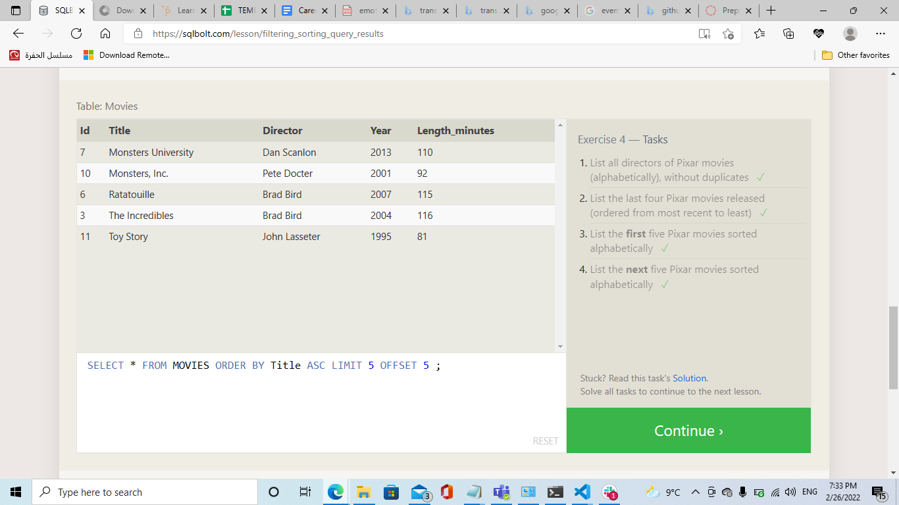
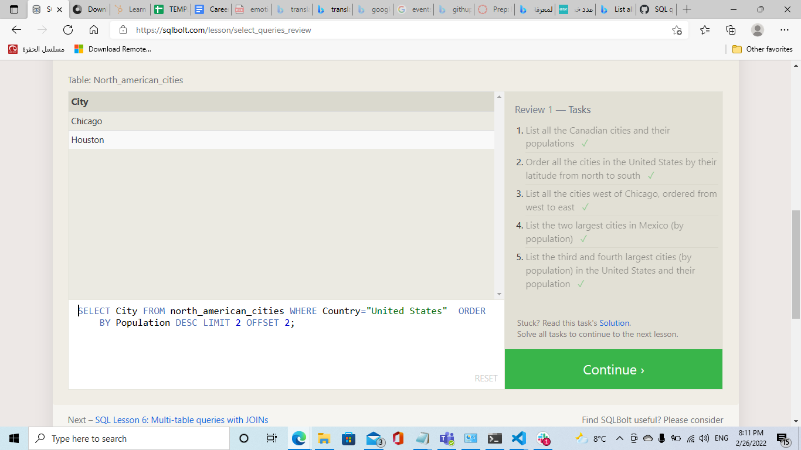
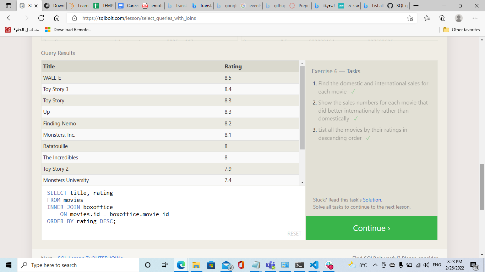
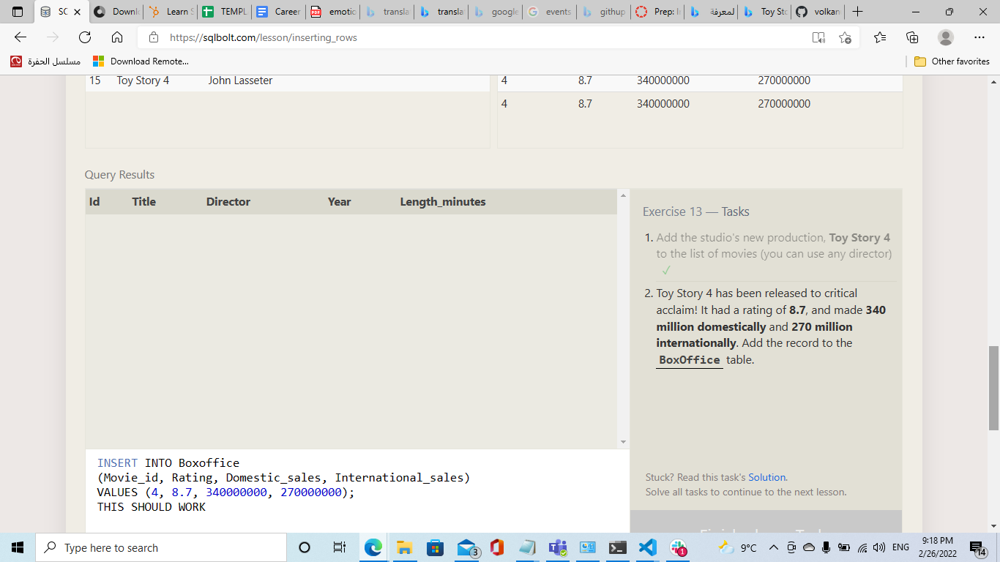
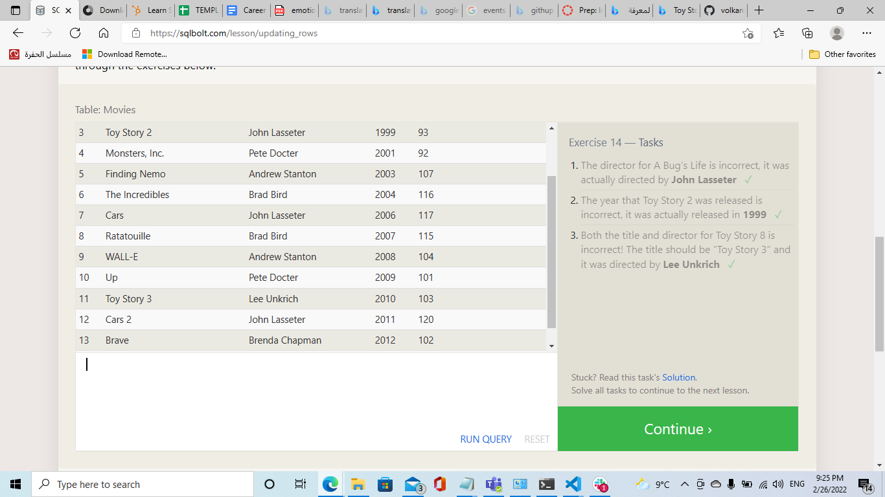
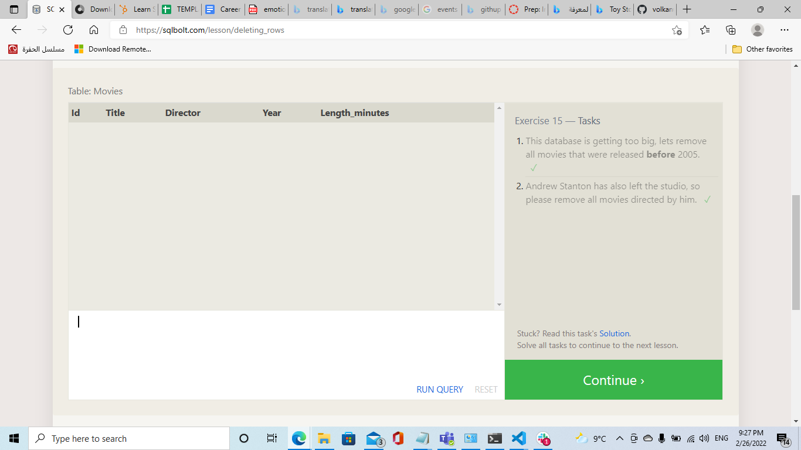
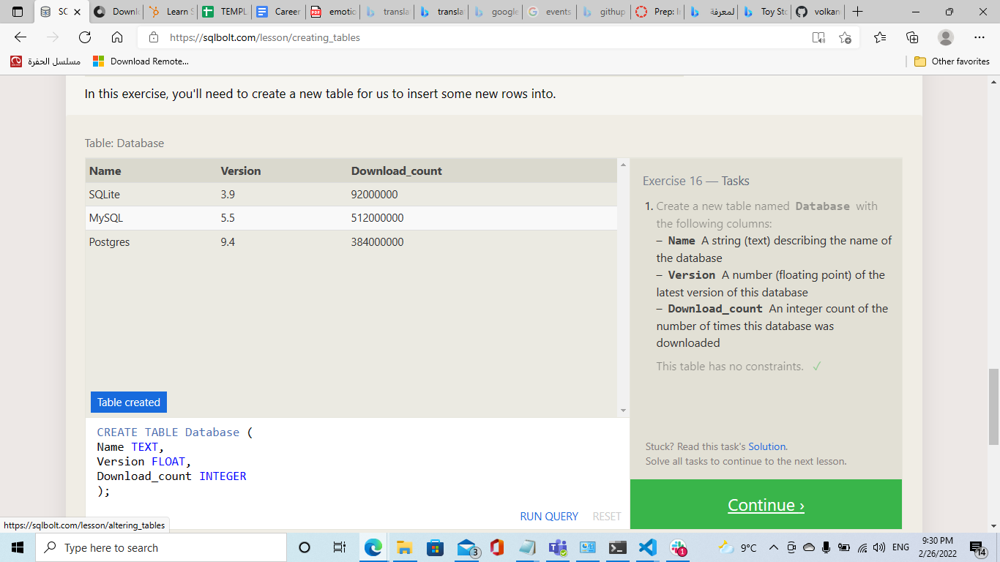
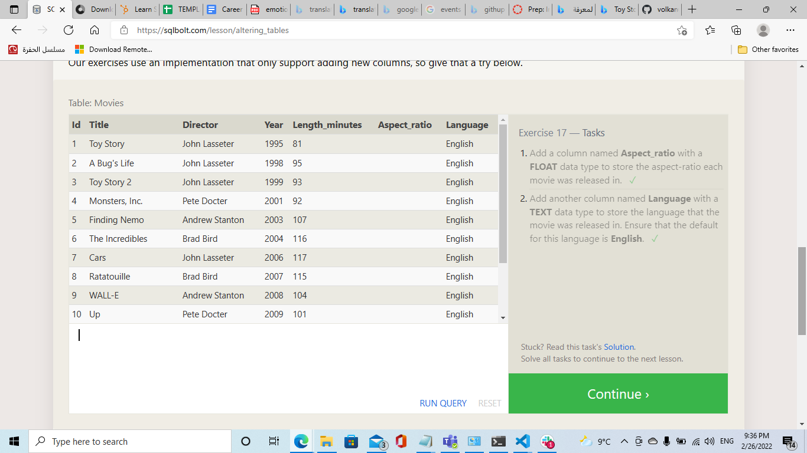
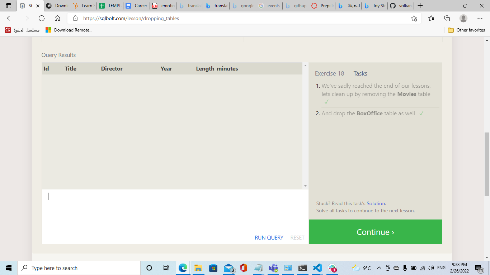

