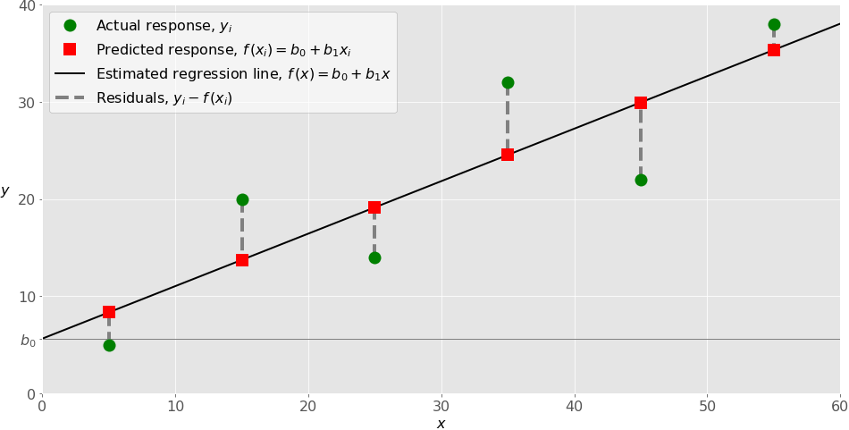

# implementing linear regression in Python

# Regression

Regression analysis is one of the most important fields in statistics and machine learning.

Generally, in regression analysis, you usually consider some phenomenon of interest and have a number of observations. Each observation has two or more features. Following the assumption that (at least) one of the features depends on the others, you try to establish a relation among them.

## When Do You Need Regression?

you need regression to answer whether and how some phenomenon influences the other or how several variables are related.
## Linear Regression

Linear regression is probably one of the most important and widely used regression techniques. It’s among the simplest regression methods. 

Linear regression calculates the estimators of the regression coefficients

he estimated or predicted response, 𝑓(𝐱ᵢ), for each observation 𝑖 = 1, …, 𝑛, should be as close as possible to the corresponding actual response 𝑦ᵢ. The differences 𝑦ᵢ - 𝑓(𝐱ᵢ) for all observations 𝑖 = 1, …, 𝑛, are called the residuals. Regression is about determining the best predicted weights, that is the weights corresponding to the smallest residuals.

## Regression Performance

The variation of actual responses 𝑦ᵢ, 𝑖 = 1, …, 𝑛, occurs partly due to the dependence on the predictors 𝐱ᵢ. However, there is also an additional inherent variance of the output.

## Simple Linear Regression

Simple or single-variate linear regression is the simplest case of linear regression with a single independent variable, 𝐱 = 𝑥.

## Polynomial Regression

You can regard polynomial regression as a generalized case of linear regression. You assume the polynomial dependence between the output and inputs and, consequently, the polynomial estimated regression function.

## Underfitting and Overfitting

One very important question that might arise when you’re implementing polynomial regression is related to the choice of the optimal degree of the polynomial regression function.

1. Underfitting occurs when a model can’t accurately capture the dependencies among data, usually as a consequence of its own simplicity. It often yields a low 𝑅² with known data and bad generalization capabilities when applied with new data.
2. Overfitting happens when a model learns both dependencies among data and random fluctuations. In other words, a model learns the existing data too well. Complex models, which have many features or terms, are often prone to overfitting. When applied to known data, such models usually yield high 𝑅². However, they often don’t generalize well and have significantly lower 𝑅² when used with new data.

## Implementing Linear Regression in Python

Python Packages for Linear Regression
The package NumPy is a fundamental Python scientific package that allows many high-performance operations on single- and multi-dimensional arrays. It also offers many mathematical routines. Of course, it’s open source.

## Simple Linear Regression With scikit-learn

There are five basic steps when you’re implementing linear regression:

Import the packages and classes you need.
~~~
import numpy as np
from sklearn.linear_model import LinearRegression
~~~

Provide data to work with and eventually do appropriate transformations.
~~~
x = np.array([5, 15, 25, 35, 45, 55]).reshape((-1, 1))
y = np.array([5, 20, 14, 32, 22, 38])
~~~

Create a regression model and fit it with existing data.

Check the results of model fitting to know whether the model is satisfactory.

Apply the model for predictions.

1. Step 1: Import packages and classes

~~~
import numpy as np
from sklearn.linear_model import LinearRegression

~~~
2. Step 2: Provide data
~~~
x = np.array([5, 15, 25, 35, 45, 55]).reshape((-1, 1))
y = np.array([5, 20, 14, 32, 22, 38])
~~~
3. Step 3: Create a model and fit it

~~~
model = LinearRegression()

~~~
This statement creates the variable model as the instance of LinearRegression. You can provide several optional parameters to LinearRegression:

fit_intercept is a Boolean (True by default) that decides whether to calculate the intercept 𝑏₀ (True) or consider it equal to zero (False).
normalize is a Boolean (False by default) that decides whether to normalize the input variables (True) or not (False).
copy_X is a Boolean (True by default) that decides whether to copy (True) or overwrite the input variables (False).

n_jobs is an integer or None (default) and represents the number of jobs used in parallel computation.
 None usually means one job and -1 to use all processors.

~~~
model.fit(x, y)

model = LinearRegression().fit(x, y)

~~~
4. Step 4: Get results

~~~
>>> r_sq = model.score(x, y)
>>> print('coefficient of determination:', r_sq)
coefficient of determination: 0.715875613747954
~~~

~~~
>>> print('intercept:', model.intercept_)
intercept: 5.633333333333329
>>> print('slope:', model.coef_)
slope: [0.54]
~~~

5. Step 5: Predict response

~~~
>>> y_pred = model.predict(x)
>>> print('predicted response:', y_pred, sep='\n')
predicted response:
[ 8.33333333 13.73333333 19.13333333 24.53333333 29.93333333 35.33333333]
~~~

~~~

>>> y_pred = model.intercept_ + model.coef_ * x
>>> print('predicted response:', y_pred, sep='\n')
predicted response:
[[ 8.33333333]
 [13.73333333]
 [19.13333333]
 [24.53333333]
 [29.93333333]
 [35.33333333]]

~~~
## Polynomial Regression With scikit-learn

Implementing polynomial regression with scikit-learn is very similar to linear regression. There is only one extra step: you need to transform the array of inputs to include non-linear terms such as 𝑥².

1. Step 1: Import packages and classes
~~~
import numpy as np
from sklearn.linear_model import LinearRegression
from sklearn.preprocessing import PolynomialFeatures
~~~
2.step 2a Provide data
~~~
x = np.array([5, 15, 25, 35, 45, 55]).reshape((-1, 1))
y = np.array([15, 11, 2, 8, 25, 32])
~~~
Step 2b: Transform input data

This is the new step you need to implement for polynomial regression!

~~~ 
transformer = PolynomialFeatures(degree=2, include_bias=False)

~~~
3. Step 3: Create a model and fit it

~~~
model = LinearRegression().fit(x_, y)

~~~
4. Step 4: Get results

~~~
>>> r_sq = model.score(x_, y)
>>> print('coefficient of determination:', r_sq)
coefficient of determination: 0.8908516262498564
>>> print('intercept:', model.intercept_)
intercept: 21.372321428571425
>>> print('coefficients:', model.coef_)
coefficients: [-1.32357143  0.02839286]
~~~
## Beyond Linear Regression

Linear regression is sometimes not appropriate, especially for non-linear models of high complexity.

